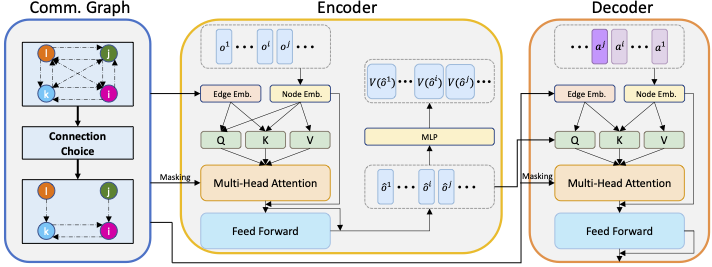

<p align="center" width="100%">
</p>

<div id="top" align="center">

Learning Multi-Agent Communication from Graph Modeling Perspective
-----------------------------
 


<h4> |<a href="https://openreview.net/forum?id=Qox9rO0kN0"> 📑 Paper </a> |
<a href="https://github.com/charleshsc/CommFormer"> 🐱 Github Repo </a> |
</h4>

<!-- **Authors:** -->

_**Shengchao Hu<sup>1,2</sup>, Li Shen<sup>3\*</sup>, Ya Zhang<sup>1,2</sup>, Dacheng Tao<sup>4</sup>**_


<!-- **Affiliations:** -->


_<sup>1</sup> Shanghai Jiao Tong University,
<sup>2</sup> Shanghai AI Laboratory,
<sup>3</sup> JD Explore Academy,
<sup>4</sup> Nanyang Technological University._

</div>


## Contents

- [Overview](#overview)
- [Installation](#installation)
- [Quick Start](#quick-start)
- [Citation](#citation)
- [Acknowledgements](#acknowledgments)


## Overview

In numerous artificial intelligence applications, the collaborative efforts of multiple intelligent agents are imperative for the successful attainment of target objectives. To enhance coordination among these agents, a distributed communication framework is often employed. However, information sharing among all agents proves to be resource-intensive, while the adoption of a manually pre-defined communication architecture imposes limitations on inter-agent communication, thereby constraining the potential for collaborative efforts.
    
In this study, we introduce a novel approach wherein we conceptualize the communication architecture among agents as a learnable graph. 
We formulate this problem as the task of determining the communication graph while enabling the architecture parameters to update normally, thus necessitating a bi-level optimization process. Utilizing continuous relaxation of the graph representation and incorporating attention units, our proposed approach, CommFormer, efficiently optimizes the communication graph and concurrently refines architectural parameters through gradient descent in an end-to-end manner. Extensive experiments on a variety of cooperative tasks substantiate the robustness of our model across diverse cooperative scenarios, where agents are able to develop more coordinated and sophisticated strategies regardless of changes in the number of agents. 

<p align="center">
     <br>
</p>

## Installation

### Dependences
``` Bash
pip install -r requirements.txt
```

### StarCraft II & SMAC
Run the script
``` Bash
bash install_sc2.sh
```
Or you could install them manually to other path you like, just follow here: https://github.com/oxwhirl/smac.

### Google Research Football
Please following the instructios in https://github.com/google-research/football. 


## Quick Start
When your environment is ready, you could run shells in the "scripts" folder with algo="commformer_dec". For example:
``` Bash
bash ./train_smac.sh  # run CommFormer on SMAC
```
If you would like to change the configs of experiments, you could modify sh files or look for config.py for more details.


## Citation
If you find this work is relevant with your research or applications, please feel free to cite our work!
```
@misc{hu2024learning,
      title={Learning Multi-Agent Communication from Graph Modeling Perspective}, 
      author={Hu, Shengchao and Shen, Li and Zhang, Ya and Tao, Dacheng},
      booktitle={International Conference on Learning Representations (ICLR)}
      year={2024},
      
}
```

## Acknowledgments

This repo benefits from [MAT](https://github.com/PKU-MARL/Multi-Agent-Transformer), [NDQ](https://github.com/TonghanWang/NDQ), and [IC3Net](https://github.com/IC3Net/IC3Net). Thanks for their wonderful works!